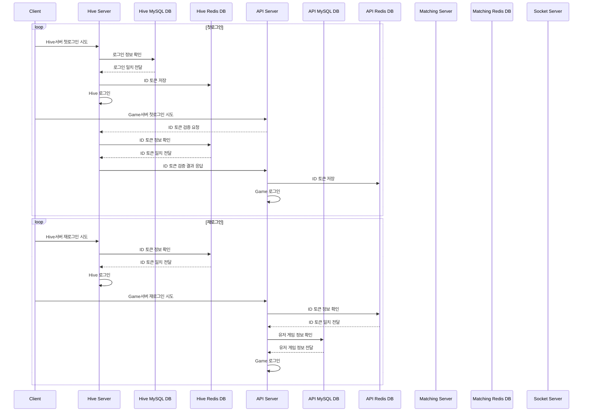

# sequenceDiagram

```mermaid
sequenceDiagram
    participant A as Client
    participant B as Hive Server
    participant C as Hive MySQL DB
    participant D as Hive Redis DB

    participant E as API Server
    participant F as API MySQL DB
    participant G as API Redis DB

    participant H as Matching Server
    participant I as Matching Redis DB

    participant J as Socket Server

    loop 첫로그인
        A->>B: Hive서버 첫로그인 시도 
        B->>C: 로그인 정보 확인
        C-->>B: 로그인 일치 전달 
        B->>D: ID 토큰 저장
        B->>B: Hive 로그인 
     
        A->>E: Game서버 첫로그인 시도
        E-->>B: ID 토큰 검증 요청
        B->>D: ID 토큰 정보 확인
        D-->>B: ID 토큰 일치 전달 
        B->>E: ID 토큰 검증 결과 응답
        E->>G: ID 토큰 저장
        E->>E: Game 로그인
    end
    loop 재로그인
        A->>B: Hive서버 재로그인 시도 
        B->>D: ID 토큰 정보 확인
        D-->>B: ID 토큰 일치 전달
        B->>B: Hive 로그인 
    
        A->>E: Game서버 재로그인 시도
        E->>G: ID 토큰 정보 확인
        G-->>E: ID 토큰 일치 전달
        E->>F: 유저 게임 정보 확인
        F-->>E: 유저 게임 정보 전달
        E->>E: Game 로그인
    end

```
